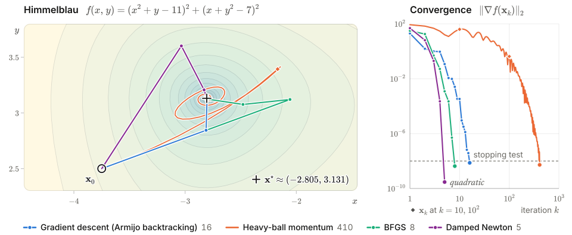

<p align="center">
  <picture>
    <source media="(prefers-color-scheme: dark)" srcset="docs/brand/logo/wordmark-dark.svg">
    
  </picture>
</p>

<div align="center">

**numopt** — 168 numerical methods, each cited to its algorithm and equation, tested against an
oracle, and replayable iterate by iterate in the browser.

</div>

<p align="center">
  <a href="https://github.com/ML-Dev-Hub/numopt/actions/workflows/ci.yml"></a>
  
  <a href="LICENSE"></a>
</p>

<h3 align="center"><a href="https://ml-dev-hub.github.io/numopt/">Open the interactive labs →</a></h3>
<p align="center">16 labs, nothing to install<br>
<a href="https://ml-dev-hub.github.io/numopt/#/methods">Methods</a> ·
<a href="https://ml-dev-hub.github.io/numopt/#/research">Research</a></p>

<p align="center">
  <picture>
    <source media="(max-width: 640px) and (prefers-color-scheme: dark)" srcset="docs/brand/readme-hero/hero-stacked-dark.svg">
    <source media="(max-width: 640px)" srcset="docs/brand/readme-hero/hero-stacked-light.svg">
    <source media="(prefers-color-scheme: dark)" srcset="docs/brand/readme-hero/hero-dark.svg">
    
  </picture>
</p>
<p align="center"><sub>Four runs of <code>numopt.run</code> on Himmelblau's function from <b>x</b>₀ = (−3.75, 2.5) with one
stopping test: the first iterate with ‖∇<i>f</i>(<b>x</b><sub>k</sub>)‖₂ ≤ 10⁻⁸. Other parameters are the
registered defaults · <a href="docs/brand/scripts/make_hero.py">reproduce</a></sub></p>

A run returns more than an answer. It returns every iterate, the exact number of function,
gradient and Hessian evaluations, and the stopping test that ended it. The Python package is the
reference implementation.

## Quick start

numopt needs Python 3.11 or later, and its only runtime dependency is NumPy.

```bash
pip install git+https://github.com/ML-Dev-Hub/numopt
```

> [!NOTE]
> The distribution is named `numopt-lab` (the PyPI name `numopt` belongs to another project), so
> `pip install numopt` installs the wrong package. It imports as `import numopt`.

```python
import numopt

rosen = numopt.problems.get("rosenbrock")
res = numopt.run("bfgs", rosen, x0=[-1.2, 1.0])

res.converged, res.n_iter  # (True, 38)
res.n_fev, res.n_gev, res.n_hev  # (56, 45, 0)
res.trace[1].info["alpha"]  # 0.00135 (strong Wolfe step at k = 1)

gd = numopt.run("gradient_descent", rosen, x0=[-1.2, 1.0])
gd.converged, gd.message  # (False, 'reached max_iter=5000 (‖∇f(x)‖ = 0.00117 > gtol)')
```

The command line reaches the same methods and problems:

```bash
numopt run bfgs rosenbrock --trace     # one row per iterate, k = 0 … 38
numopt list --family roots             # the 16 root finders with their convergence orders
numopt problems --kind lp              # the 10 linear programs in the problem library
```

## What's inside

`numopt list` prints every method, and `numopt problems` lists the 103 test problems. Each family
name below opens its lab.

| Group | Families (methods) | For example |
|:--|:--|:--|
| Equations | [Root finding](https://ml-dev-hub.github.io/numopt/#/lab/roots) (16) · [Nonlinear systems](https://ml-dev-hub.github.io/numopt/#/lab/systems) (2) · [Linear systems](https://ml-dev-hub.github.io/numopt/#/lab/linalg) (14) | Brent, Newton–Raphson, Broyden, GMRES |
| Optimization | [1-D minimization](https://ml-dev-hub.github.io/numopt/#/lab/scalar) (8) · [Line search](https://ml-dev-hub.github.io/numopt/#/lab/line-search) (5) · [Unconstrained](https://ml-dev-hub.github.io/numopt/#/lab/unconstrained) (42) · [Nonlinear least squares](https://ml-dev-hub.github.io/numopt/#/lab/least-squares) (2) · [Global](https://ml-dev-hub.github.io/numopt/#/lab/global) (5) · [Stochastic gradients](https://ml-dev-hub.github.io/numopt/#/lab/stochastic) (9) | BFGS, L-BFGS, Nelder–Mead, Adam, CMA-ES, SVRG |
| Constrained & discrete | [Constrained](https://ml-dev-hub.github.io/numopt/#/lab/constrained) (6) · [Linear & integer programming](https://ml-dev-hub.github.io/numopt/#/lab/lp) (10) · [Combinatorial](https://ml-dev-hub.github.io/numopt/#/lab/combinatorial) (10) | SQP, simplex, branch and bound, Held–Karp |
| Numerical analysis & data | [Quadrature](https://ml-dev-hub.github.io/numopt/#/lab/integration) (13) · [Differentiation](https://ml-dev-hub.github.io/numopt/#/lab/differentiation) (7) · [Interpolation](https://ml-dev-hub.github.io/numopt/#/lab/interpolation) (12) · [Regression](https://ml-dev-hub.github.io/numopt/#/lab/regression) (7) | Gauss–Legendre, complex step, AAA, Huber |

## How each method is checked

- **Cited.** Each method names its source, down to the algorithm and equation
  (`numopt.get_method("bfgs").references` → Nocedal & Wright 2006, Algorithm 6.1, eqs. 6.17 and 6.20).
- **Tested against oracles.** Each method converges on at least two problems, has a failure-path
  test, and is checked against SciPy or NumPy where an equivalent exists.
- **Parity-checked.** The labs run a TypeScript port of each method. Each port must reproduce the
  first ten Python iterates within 10⁻⁸ and, for a deterministic method, the iteration count
  exactly. CI fails on stale fixtures.
- **Honest about failure.** `converged=True` only when the documented stopping test passed. A
  singular Hessian or an exhausted budget returns `converged=False` with a message that says what
  happened; no method raises on numerical breakdown.

## Research

[`research/`](research/README.md) holds nine reproducible studies. Eight test a newer method
against the classics on equal budgets and state where it loses; one tests the benchmarking method
itself. In one study, re-tuned Adam needs 9.2 times as many iterations on an ill-conditioned
quadratic turned 45° from the coordinate axes as on the aligned one, while gradient descent needs
exactly as many.

## Documentation

[Architecture](docs/architecture.md) (the `Result` and `Step` contract) ·
[Contributing](CONTRIBUTING.md) · [Research protocol](research/README.md#the-protocol)

## Citing

GitHub's **Cite this repository** button reads [`CITATION.cff`](CITATION.cff). When you cite a
method, also cite its original source, which `numopt.get_method(id).references` lists.

numopt is released under the [MIT license](LICENSE).
